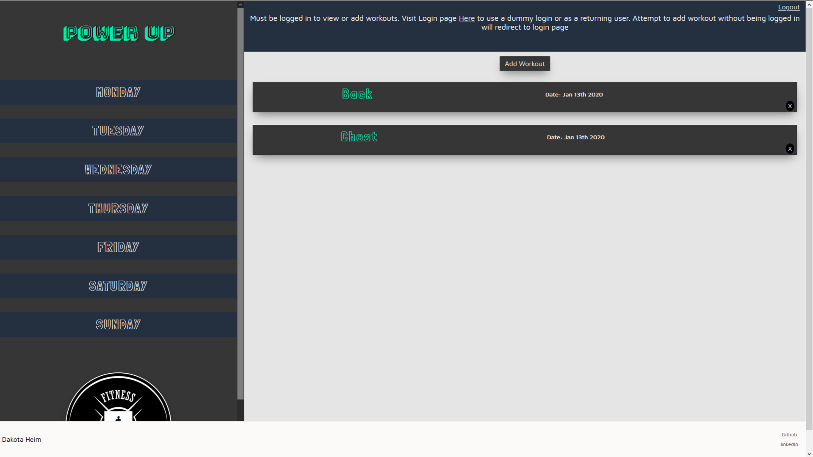
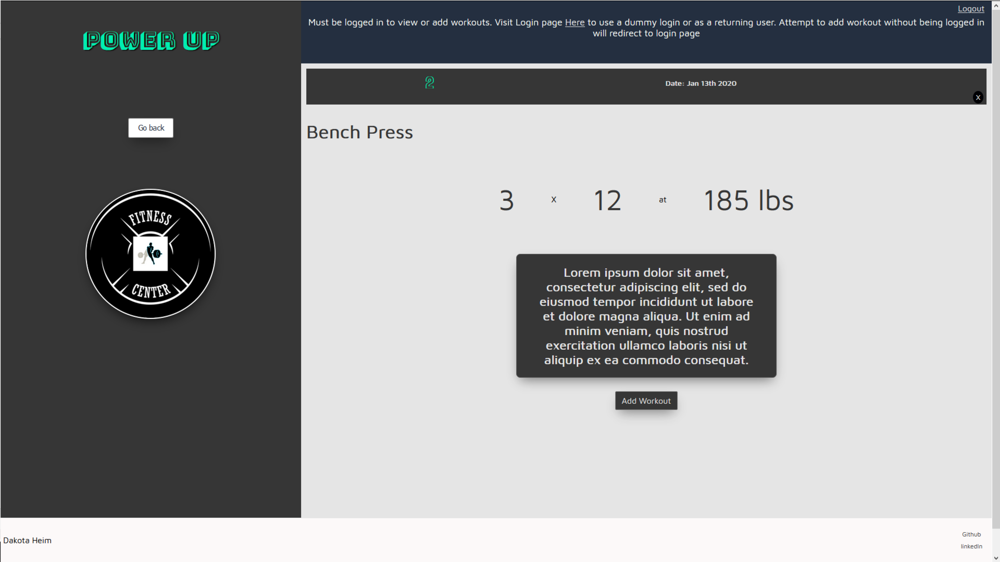
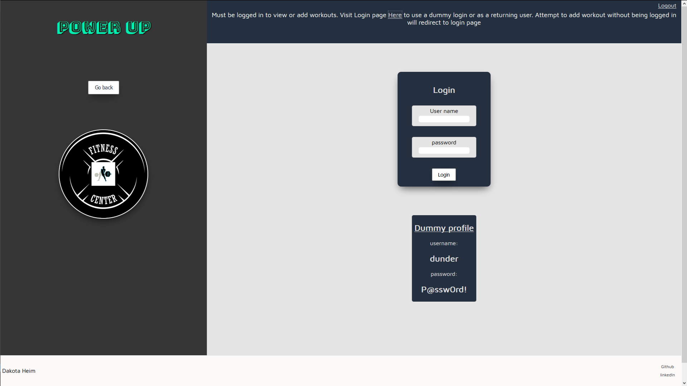
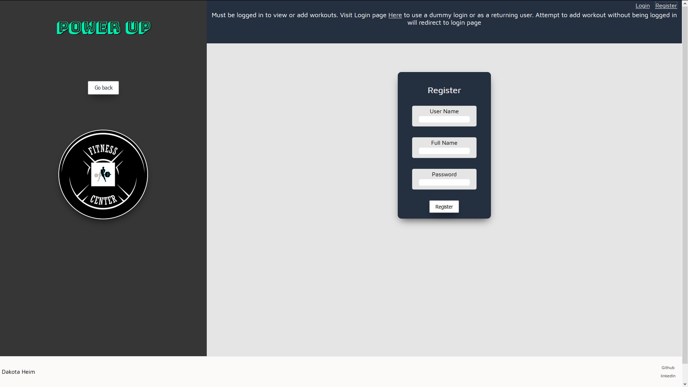

# Power Up: A weight lifting daily log app

# Live Link

[Live](https://power-up-app-bwyi8ooka.now.sh/)

# Api

a RESTful API made using Express.js

[Server Source Code]([Api Repo](https://github.com/Kotieheim/power-up-app-server))

# Screenshots

# Summary

A weight lifting logger that allows you to fill out workouts daily and then sort by days of the week. This makes it easier to follow a workout program and to keep yourself accountable to performing the right workouts on each day of the week. The homepage lists all workouts starting from the most recent and then goes in a decending order. The detailed page of every individual workout also lists a number telling you the number of the logged workout allowing to keep track of how many days you've worked out in all.

# Technologies Used

Made using React.js, Express.js and PostgreSQL.
